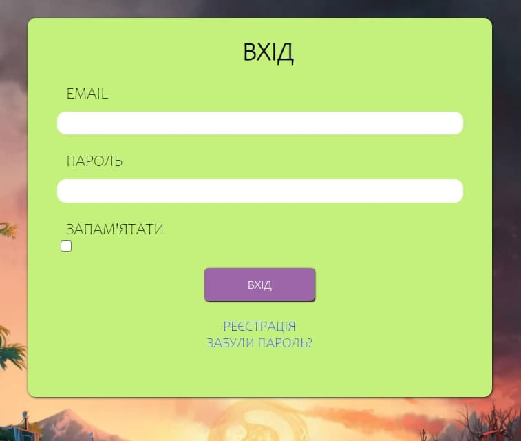
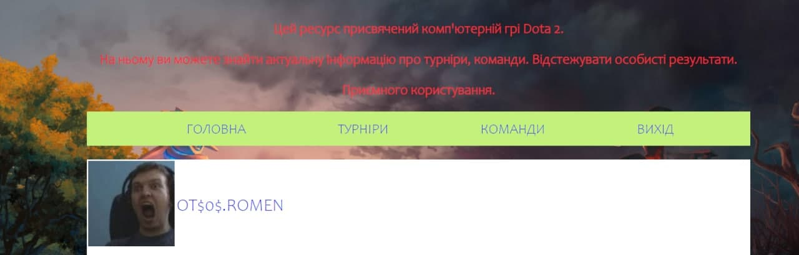
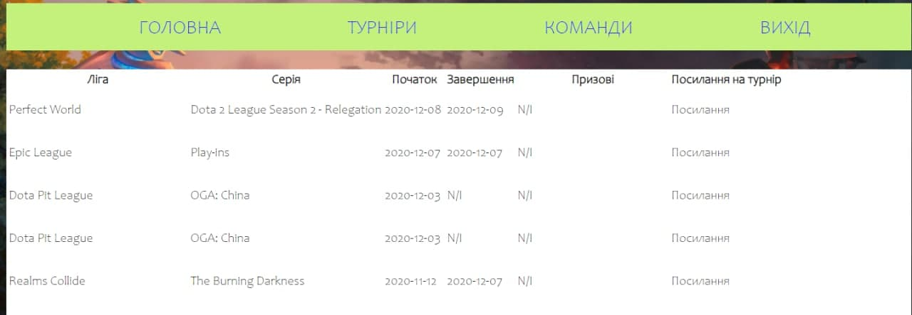
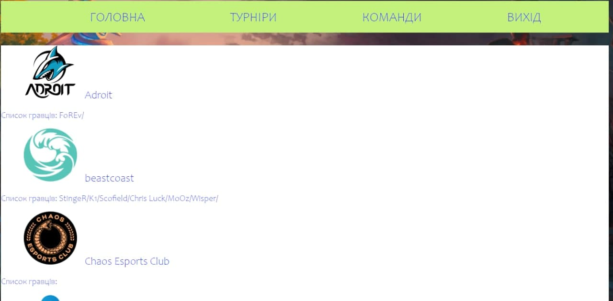

# DotaScrapper
Даний веб додаток представляє категорію **Ком'ютерны ігри**
Підійде він для поціновувачів багатокористувацьких відеоігор, на кшталт Dota2.
Тут ви зможете спостерігати за улюбленими командами й шукати найближчі ігрові турнір, відстежувати власні результати.

## API
Для реалізації продукту в нас використано [PandaScore REST API](https://developers.pandascore.co/doc/)

## Інструкція
Щоб скористатись проектом, перейдіть за [посиланням](http://165.22.76.156/)

Для не зареєстрованих користувачів потрібно пройти процес реєстрації
натисніть на кнопку реєстрації:

й пройти реєстрацію, де потрібно вказати ваш емейл, акаунт ID з Steam та придумати пароль:

Для зареєстрованих користувачів пройти звичайний вхід, де вказати свій емейл та пароль. 
Щоб не здійснювати повторних входів, можете поставити галочку біля *запам'ятати*, щоб система зберегла дані входу:

Після входу ви побачите свою сторінку користувача. На головній сторінці вказані користувачі та ваші друзі:

При переході на вкладку *Турніри*, вам будуть висвітлені найближчі події по даній категорії:

На вкладці *Команди*, ви можете слідкувати за улюбленими командами, бачити їх опис та події пов'язані з ними:

Здійснити вихід з облікового запису ви можете за допомогою кнопки *Вихід*.
